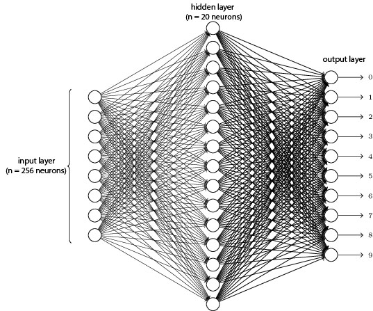

#Python Work
Python is used to build the neural network. Python has been used because while developing a neural network we have to deal with various matrix operations like getting the array from file as n-dimensional matrix, reshaping the dimensions of matrix, addition, transpose and multiplication of matrix and in python these operations can be performed with an ease that helps give more time in desiging the network.

###Generating Training Sets
Various Sample Images of digits were collected from segmentation process and were saved under the directory **training images** and subdirectory their digit number. All these 16x16 images are written into trainingssets.txt with black pixel value 0 and white pixel value 1. The row of binary values is finally appended with the actual value of the digit which is required prior during training the model.

###Neural Network Architecture
Our neural network consists of 3 layers; input-hidden-output layer. Input layer has 256 nodes that takes the bit values of 16x16 images as 256x1 matrix. Hidden layer has 20 nodes and output layer has 10 nodes that classify between digit 0 to 9. 

Stochastic gradient method is used to caliberate the weights of the neural network with a mini batch size of 10 i.e 10 samples from the training sets are taken at once to train the network. On the other hand batch gradient descent method was inappropriate because it takes the whole training data set at once and we have large set of training sets. The training is completed in 1000 iterations so as to minimize the errors.

In addition to the weights we have the bias nodes for each hidden layer and output layer that offsets the output value to the desired results.

###Steps to train
1.	Save the images in related folders inside trainingSets directory
2.	Run generateTrainigSets that would create trainingsets.txt file that would be the training sets for model
3.	Run trainNetwork to train the neural network with produced training sets
4.	After training, the weights of the network will be saved in weights.json
5.	Save the images you want to recognize in testSets directory
6.	Run testOutput to check if network produces the appropriate results.

###Different Modules
1.	generateTraininSets: Produces training sets for the model using processImage and save it to the file trainingsets.txt
2.	processImage:	Receives the images from the directory trainingImages and converts them to 16x16 image and procduces it binary data of 256 bits with the last bit appended with respective digit.
3.	dataExtractor: Extracts data from trainingsets and vectorize it to make it input to the network.
4.	trainNetwork: Trains the neural network and saves the final output weights to weights.json
5.	testOutput: Recognizes the images in testImages folder using weights of weights.json
6.	trainingsets.txt: file to save the trainingsets
7.	weights.json: json file to save weights 

###Remarks	 
The project RcardScanner needs the weight.json file that came after training the network. This file can be imported in android project and parsed to get the required weights to recognize the digits

###References
*	[Introduction to Artificial Intelligence OCR using Artificial Neural Networks](http://www.kloover.com/publications/Kluever_-_OCR_using_ANN.pdf)
*	[multi-layer perceptron (MLP) architecture: criteria for choosing number of hidden layers and size of the hidden layer](http://stackoverflow.com/questions/10565868/multi-layer-perceptron-mlp-architecture-criteria-for-choosing-number-of-hidde)
*	[A Neural Network in 11 lines of Python ](https://iamtrask.github.io/2015/07/12/basic-python-network/)
*	[How to build a simple neural network in 9 lines of Python code](https://medium.com/technology-invention-and-more/how-to-build-a-simple-neural-network-in-9-lines-of-python-code-cc8f23647ca1#.fg42u8xmr)
*	[Neural Networks Demystified](https://www.youtube.com/watch?v=bxe2T-V8XRs)
*	[NEURAL NETWORKS WITH BACKPROPAGATION FOR XOR USING ONE HIDDEN LAYER](http://www.bogotobogo.com/python/python_Neural_Networks_Backpropagation_for_XOR_using_one_hidden_layer.php)
*	[Gradient Descent with Backpropagation](http://outlace.com/Beginner-Tutorial-Backpropagation/)
*	[Effecient Backprop](http://yann.lecun.com/exdb/publis/pdf/lecun-98b.pdf)
*	[Coursera Machine Learning by Stanford University](https://www.coursera.org/learn/machine-learning)
*	[DeepLearing for handwritten recognition](http://neuralnetworksanddeeplearning.com/chap1.html)
*	[Handwritten Character Recognition Using Neural Network](http://yann.lecun.com/exdb/publis/pdf/matan-90.pdf)
*	[Using neural nets to recognize handwritten digits](http://neuralnetworksanddeeplearning.com/chap1.html)
*	[ARTIFICIAL NEURAL NETWORK BASED OPTICAL CHARACTER RECOGNITION](http://arxiv.org/pdf/1211.4385.pdf)
*	[DEVNAGARI DOCUMENT SEGMENTATION USING HISTOGRAM APPROACH](https://arxiv.org/pdf/1109.1247.pdf)
*	[training feedforward neural network for OCR](http://stackoverflow.com/questions/9684204/training-feedforward-neural-network-for-ocr)